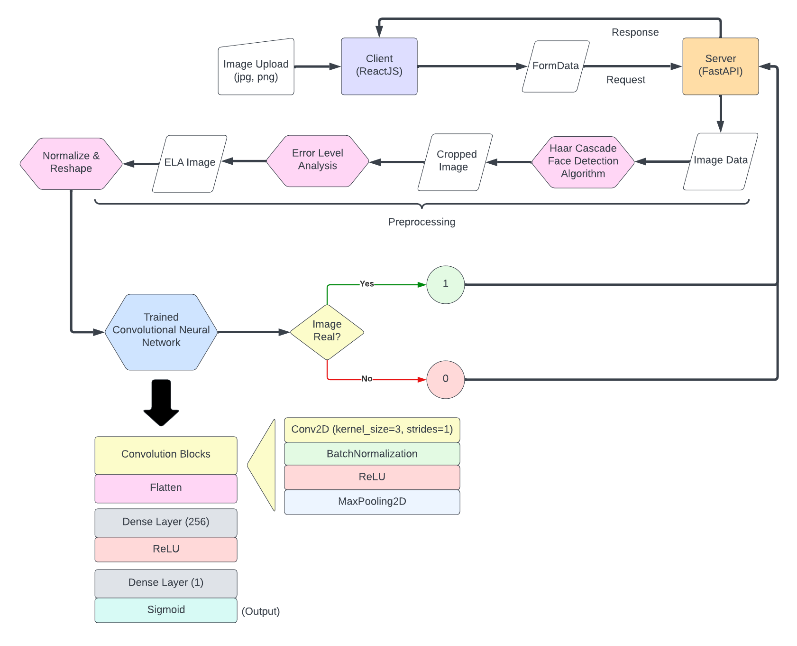

# Demo

You can try out the live demo here: https://cinnamon-ai-entrance-test-ntc.vercel.app/

# Introduction:

This is my project for the CinnamonBootcamp2023 Pre-entrance test.
In the time where there is an explosion in the number of image editing and image generation tools, sometimes we just cannot distinguish between real and edited images.
Therefore, I came up with a project which is a website application with AI-integrated backend that can help predict whether an image is real or edited/fake using Machine Learning.

# Technical Overview:

Let's take a look at the following diagram:

As can be seen the application predict whether a face image is real or not using a combination of Haar Cascade Face Detection Algorithm - a common used algorithm for recognizing faces in images, Error Level Analysis, or ELA - a technique used in photo forensic to help detects edited images, and finally a binary-classification CNN Machine Learning model that has been trained using ELA images from the following dataset: https://www.kaggle.com/datasets/ciplab/real-and-fake-face-detection.

The CNN Models only used 3 Conv2D layers before flattened and the value is then put through a Dense layer of 256 neurons and then the output layer of one neuron. Since it is a single output CNN, I used the sigmoid activation function at the output layer, which return a number in between 1 and 0, with 1 being "the image is real" and 0 being "The image is fake". The model and then trained on Kaggle using TPU. The test result is around 70% in accuracy.

Regarding the application, I setup a reactJS client using Vite, the UI and basic functionalities are inspired from https://github.com/adrianhajdin/project_3D_developer_portfolio.git, which used react-three (Three.js for React) and tailwindcss for styling. The client is then deployed using https://vercel.com/. The backend server is built from scratch using FastAPI, the server is responsible for preprocessing and running the AI model. The server is deployed using https://render.com/.

# Usage

###CLIENT SETUP GUIDE###
#Go to the client folder
cd client
npm i --save --force

    #Run the client locally

    npm run dev

###SERVER SETUP GUIDE###
#Go to the src folder of the server
cd server
cd src

    #Activate the virtual environment

    #FOR LINUX USERS:

        python3 -m venv venv
        source venv/bin/activate

    #FOR WINDOWS USERS:

        python -m venv venv
        ./venv/Scripts/activate

    #Install dependencies:

    pip install -r requirements.txt

    #Install the AI model
    #Remember to create ./model/variables and ./model/assets directories first!

    gdown 1kJvvTlT9VAqP1drZniMdzbYuO00CmNac -O ./model/fingerprint.pb
    gdown 1SWhkFJH_QYhicFn6TePhpCtCSz4w-jQ8 -O ./model/saved_model.pb
    gdown 1U6lTdDUktU7AwkzpCoKVMBM-5aLsI30T -O ./model/variables/variables.data-00000-of-00001
    gdown 18x6TPScu6LOBCW9dptpOOce7rH-jtp-Y -O ./model/variables/variables.index
    #Run the server locally

    uvicorn main:app --reload
